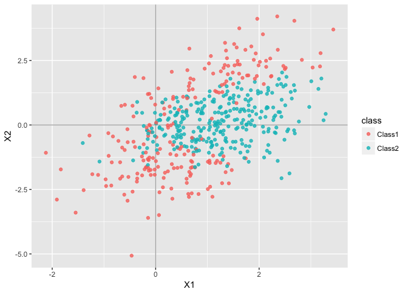
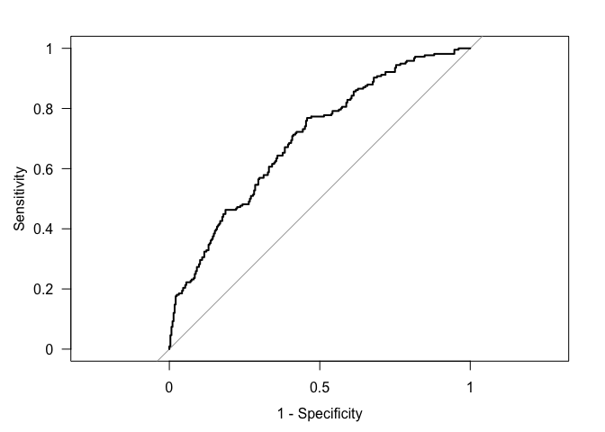
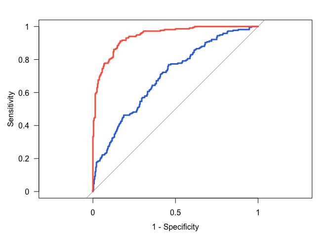

ROC Curve
================
Gaston Sanchez

This document is based on the simulation study discussed in Chapter 11, from *Applied Predictive Modeling* by Kuhn and Johnson (2013).

The required R packages are:

``` r
library(AppliedPredictiveModeling)
library(caret)
library(ggplot2)
library(MASS)
library(pROC)
```

Introduction
------------

"The ROC curve is used for determining alternate cutoffs for class probabilities. This curve is created by evaluating the class probabilities for the model across a continuum of thresholds. For each candidate threshold, the resulting true positive rate (i.e. sensitivity) and the false-positive rate (1 - specificity) are plotted against each other." (Kuhn and Johnson, 2013)"

------------------------------------------------------------------------

Simulated Data
--------------

A simulated data set with two predictors, and one response variable with two classes is obtained with `quadBoundaryFunc()`

``` r
# simulated data with function quadBoundaryFunc() which
# creates a class boundary that is a function of both predictors. 
set.seed(975)
simulated_train <- quadBoundaryFunc(500)

head(simulated_train)
```

    ##           X1          X2      prob  class
    ## 1  2.4685709  2.28742015 0.9647251 Class1
    ## 2 -0.1889407 -1.63949455 0.9913938 Class1
    ## 3 -1.9101460 -2.89194964 1.0000000 Class1
    ## 4  0.3481279  0.06707434 0.1529697 Class1
    ## 5  0.1401153  0.86900555 0.5563062 Class1
    ## 6  0.7717148 -0.91504835 0.2713248 Class2

Let's see what the data looks like:

``` r
ggplot(simulated_train, aes(x = X1, y = X2)) + 
  geom_vline(xintercept = 0, color = 'gray70') + 
  geom_hline(yintercept = 0, color = 'gray70') +
  geom_point(aes(color = class), alpha = 0.8)
```



We can add density curves to visualize the ellipses:

``` r
ggplot(simulated_train, aes(x = X1, y = X2)) + 
  geom_vline(xintercept = 0, color = 'gray70') + 
  geom_hline(yintercept = 0, color = 'gray70') +
  geom_density2d(color = 'gray60') +
  geom_point(aes(color = class), alpha = 0.8)
```


------------------------------------------------------------------------

Linear Discriminant Analysis (LDA)
----------------------------------

We begin the classification model building process by fitting a model using linear discriminant analysis. This is done with the function `lda()` from `"MASS"`:

``` r
# LDA
lda_fit <- lda(class ~ X1 + X2, data = simulated_train)
lda_pred_train <- predict(lda_fit, simulated_train)
```

Using the predictions, we can get the following confussion matrix:

``` r
lda_confussion <- table(obs = simulated_train$class, pred = lda_pred_train$class)
lda_confussion
```

    ##         pred
    ## obs      Class1 Class2
    ##   Class1    104    112
    ##   Class2     73    211

and the associated *default* error rate given by:

``` r
# error rate (misclasification rate)
1 - sum(diag(lda_confussion)) / nrow(simulated_train)
```

    ## [1] 0.37

------------------------------------------------------------------------

### Quadratic Discriminant Analysis (QDA)

The second model involves fitting a QDA with the function `qda()` from `"MASS"`:

``` r
# QDA
qda_fit <- qda(class ~ X1 + X2, data = simulated_train)
qda_pred_train <- predict(qda_fit, simulated_train)
```

Confussion matrix:

``` r
qda_confussion <- table(obs = simulated_train$class, pred = qda_pred_train$class)
qda_confussion
```

    ##         pred
    ## obs      Class1 Class2
    ##   Class1    168     48
    ##   Class2     23    261

and the *default* error rate is:

``` r
1 - sum(diag(qda_confussion)) / nrow(simulated_train)
```

    ## [1] 0.142

------------------------------------------------------------------------

ROC Curve
---------

Add LDA and QDA posterior probabilities for Class 1 to the data frame of simulated data:

``` r
# adding predicted class-1 probabilities
simulated_train$ldaprob <- lda_pred_train$posterior[ ,"Class1"]
simulated_train$qdaprob <- qda_pred_train$posterior[ ,"Class1"]
```

One way to obtain ROC curves is with the `"pROC"` package. To get such a curve, you need to create a `"roc"` object with the function `roc()`.

``` r
# ROC Curve for LDA
lda_train_roc <- roc(
  response = simulated_train$class,
  predictor = simulated_train$ldaprob,
  # this function assumed that the second class
  # is the event of interest, so labels msut be reversed
  levels = rev(levels(simulated_train$class))
)

# ROC curve
plot(lda_train_roc, legacy.axes = TRUE, las = 1)
```



The ROC curve for QDA can be obtained as follows:

``` r
# ROC Curve for QDA
qda_train_roc <- roc(
  response = simulated_train$class,
  predictor = simulated_train$qdaprob,
  levels = rev(levels(simulated_train$class))
)

# ROC curve
plot(qda_train_roc, legacy.axes = TRUE, las = 1)
```


Both curves, can be plotted in the same figure:

``` r
# ROC curves
plot(lda_train_roc, legacy.axes = TRUE, las = 1, 
     col = "#2f74e2", lwd = 3)
plot(qda_train_roc, legacy.axes = TRUE, las = 1, 
     col = "tomato", lwd = 3, add = TRUE)
```


