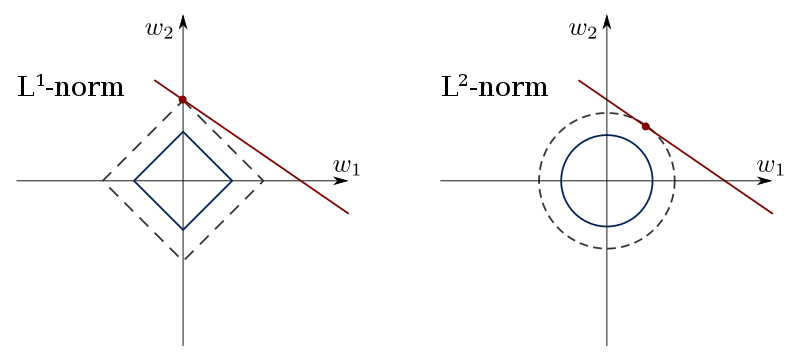

```{r setup, include=FALSE}
knitr::opts_chunk$set(echo = TRUE, error = TRUE)
library(knitr)
library(ggplot2)
library(glmnet)
library(MASS)
```

## Regularized Estimation


$$
\min_{\beta} || y -  X\beta||_2^2 + \lambda c(\beta)
$$

Where $c(\beta)$ can be any type of constraint. Usually $c$ is chosen to be convex. Norms are convex contraints e.g. $l_1$, $l_2$ etc.

* Prediction Accuracy: Provided that the true relationship between the
response and the predictors is approximately linear, the least squares
estimates will have low bias. If $n >> p$, that is, if n, the number of
observations, is much larger than p, the number of variables, then the
least squares estimates tend to also have low variance, and hence will
perform well on test observations. However, if n is not much larger than p, then there can be a lot of variability in the least squares fit,
resulting in overfitting and consequently poor predictions on future
observations not used in model training. And if $p > n$, then there
is no longer a unique least squares coefficient estimate: the variance
is infinite so the method cannot be used at all. By constraining or
shrinking the estimated coefficients, we can often substantially reduce
the variance at the cost of a negligible increase in bias. This can
lead to substantial improvements in the accuracy with which we can
predict the response for observations not used in model training.

* Model Interpretability: It is often the case that some or many of the
variables used in a multiple regression model are in fact not associated
with the response. Including such irrelevant variables leads to
unnecessary complexity in the resulting model. By removing these
variables, that is, by setting the corresponding coefficient estimates
to zero, we can obtain a model that is more easily interpreted. Now
least squares is extremely unlikely to yield any coefficient estimates
that are exactly zero.


This approach involves fitting a model involving all p predictors.
However, the estimated coefficients are shrunken towards zero
relative to the least squares estimates. This shrinkage (also known as
regularization) has the effect of reducing variance. Depending on what
type of shrinkage is performed, some of the coefficients may be estimated
to be exactly zero. Hence, shrinkage methods can also perform
variable selection.

### Closed-form solution of Ridge regression

Choosing an $l_2$ constraint, the problem is called Ridge Regression. the coefficient estimates $\hat{\beta}_{ridge}$ are,

$$\hat{\beta}_{ridge} = (X^TX + \lambda I)^{-1}X^Ty$$
Now your turn,

Write down the ridge regression as a penalized regression problem using the correct norm and solve the optimization problem to find the ridge coefficient estimates.

### Closed-form solution of Lasso regression
Choosing an $l_1$ constraint, the problem is called Ridge Regression. the coefficient estimates $\hat{\beta}_{lasso}$ are,

$$\hat{\beta}_{lasso} = S_{\lambda}(\hat{\beta_{ols}}) =  sgn(\hat{\beta_{ols}}) (|\hat{\beta_{ols}}| - \lambda )_+$$

Where $S_{\lambda}$ is a simple soft-thresholding function.

Now your turn,

Write down the lasso regression as a penalized regression problem using the correct norm and solve the optimization problem to find the lasso coefficient estimates.


### Different Mechanisms of Shrinkage?  

Exercise: Consider a simple case where $y$ is generated using a linear model and the covariate matrix is identity, i.e. $X = I$. Imagine $y = -1, -0.9, \ldots , .9, 1$. Find $\hat{\beta_{ols}}$, $\hat{\beta}_{lasso}$, $\hat{\beta}_{ridge}$ for $\lambda = 0, .5, 1$ and plot the results in one plot for each $\lambda$. What can you say about ridge v lasso?


# Examples


## Example 1 
True model: $\mathbf{y}=\mathbf{X\beta} + \mathbf{\epsilon}$

where:

- $\mathbf{\beta}=(\underbrace{1,...,1}_{15}, \underbrace{0,...,0}_{4085})^T$
- $p=5000 > n=1000$
- Uncorrelated predictors: 
    + $\mathbf{X}_i \overset{\text{iid}}{\sim} N(\mathbf{0}, \mathbf{I})$
- $\mathbf{\epsilon} \overset{\text{iid}}{\sim} N(\mathbf{0},\mathbf{I})$

### Generate Data

Now your turn,

Generate $X$ and $y$ according to the instruction above.

###Fit Model

Now your turn,

Fit three models ridge, lasso and elastic net using glmnet package and find the best hyperparameters using cv.glmnet. Also fit 10 models using $\alpha = 0, .1, \ldots, 1$ and save the models.

###Plot solution path and cross-validated MSE as function of $\lambda$

Now your turn,

Plot solution path and cross-validated MSE as function of $\lambda$

### MSE on test set

Now your turn,

Evaluate MSE on test set using all 10 models. Which one is the best?

## Example 2

True model: $\textbf{y}=\textbf{X\beta} + \textbf{\epsilon}$

where:

- $\textbf{\beta}=(\underbrace{1,...,1}_{1500}, \underbrace{0,...,0}_{3500})^T$
- $p=5000 > n=1000$
- Uncorrelated predictors: 
    + $\textbf{X}_i \overset{\text{iid}}{\sim} N(\textbf{0}, \textbf{I})$
- $\bs{\epsilon} \overset{\text{iid}}{\sim} N(\textbf{0},\textbf{I})$

### Generate Data

Now your turn,

Generate $X$ and $y$ according to the instruction above.

###Fit Model

Now your turn,

Fit three models ridge, lasso and elastic net using glmnet package and find the best hyperparameters using cv.glmnet. Also fit 10 models using $\alpha = 0, .1, \ldots, 1$ and save the models.

###Plot solution path and cross-validated MSE as function of $\lambda$

Now your turn,

Plot solution path and cross-validated MSE as function of $\lambda$

### MSE on test set

Now your turn,

Evaluate MSE on test set using all 10 models. Which one is the best?

## Example 3
True model: $y =\textbf{X\beta} + \epsilon$ 

where 

- $\textbf{\beta}=(10,10,5,5,\underbrace{1,...,1}_{10},\underbrace{0,...,0}_{36})^T$
- $p=50$
- $n=100$
- Correlated predictors: $Cov(\textbf{X})_{ij} = (0.7)^{|i-j|}$

### Generate Data

Now your turn,

Generate $X$ and $y$ according to the instruction above.

###Fit Model

Now your turn,

Fit three models ridge, lasso and elastic net using glmnet package and find the best hyperparameters using cv.glmnet. Also fit 10 models using $\alpha = 0, .1, \ldots, 1$ and save the models.

###Plot solution path and cross-validated MSE as function of $\lambda$

Now your turn,

Plot solution path and cross-validated MSE as function of $\lambda$

### MSE on test set

Now your turn,

Evaluate MSE on test set using all 10 models. Which one is the best?

### Model Comparison

Exercise: Write one paragraph comparing the three models. In what scenarios would you choose each?


## glmnet Introduction

Glmnet is a package that fits a generalized linear model via penalized maximum likelihood. The regularization path is computed for the lasso or elasticnet penalty at a grid of values for the regularization parameter lambda. The algorithm is extremely fast, and can exploit sparsity in the input matrix `x`. It fits linear, logistic and multinomial, poisson, and Cox regression models. A variety of predictions can be made from the fitted models. It can also fit multi-response linear regression.

The authors of glmnet are Jerome Friedman, Trevor Hastie, Rob Tibshirani and Noah Simon, and the R package is maintained by Trevor Hastie. The matlab version of glmnet is maintained by Junyang Qian. This vignette describes the usage of glmnet in R.

`glmnet` solves the following problem
$$
\min_{\beta_0,\beta} \frac{1}{N} \sum_{i=1}^{N} w_i l(y_i,\beta_0+\beta^T x_i) + \lambda\left[(1-\alpha)||\beta||_2^2/2 + \alpha ||\beta||_1\right],
$$
over a grid of values of $\lambda$ covering the entire range. Here $l(y,\eta)$ is the negative log-likelihood contribution for observation $i$; e.g. for the Gaussian case it is $\frac{1}{2}(y-\eta)^2$. The _elastic-net_ penalty is controlled by $\alpha$, and  bridges the gap between lasso ($\alpha=1$, the default) and ridge ($\alpha=0$). The tuning parameter $\lambda$ controls the overall strength of the penalty.

It is known that the ridge penalty shrinks the coefficients of correlated predictors towards each other while the lasso tends to pick one of them and discard the others. The elastic-net penalty mixes these two; if predictors are correlated in groups, an $\alpha=0.5$ tends to select the groups in or out together. This is a higher level parameter, and users might pick a value upfront, else experiment with a few different values. One use of $\alpha$ is for numerical stability; for example, the elastic net with $\alpha = 1 - \epsilon$ for some small $\epsilon > 0$ performs much like the lasso, but removes any degeneracies and wild behavior caused by extreme correlations.

The `glmnet` algorithms use cyclical coordinate descent, which successively optimizes the objective function over each parameter with others fixed, and cycles repeatedly until convergence. 
