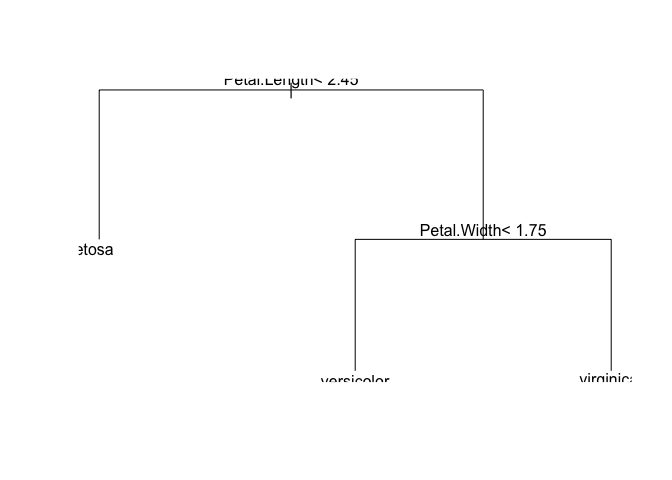
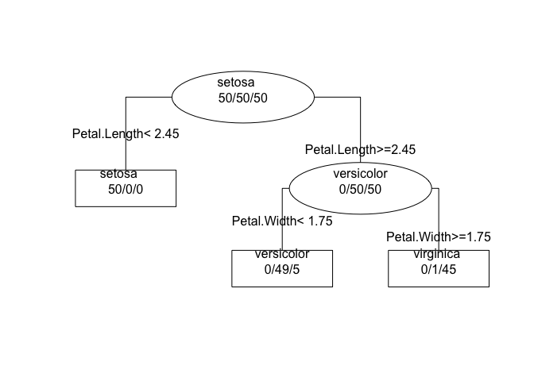
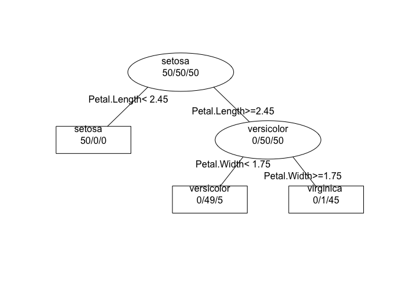
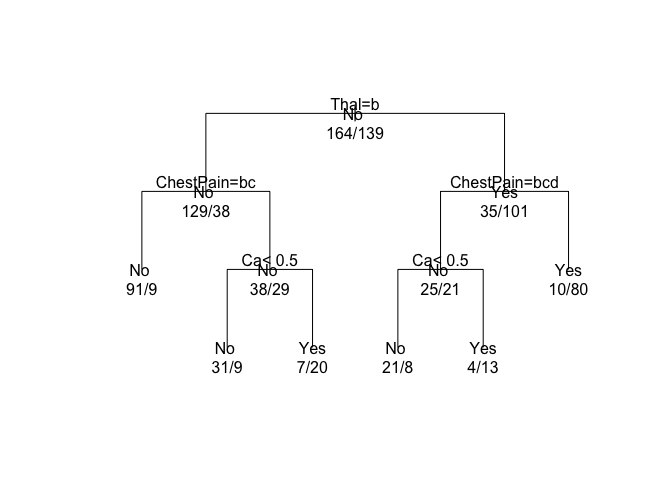

Partition Trees with `rpart`
================
Gaston Sanchez

> ### Learning Objectives:
> 
>   - Introduction to the `rpart()` function
>   - Understand parameters
>   - Understand control parameters

-----

## Decision Trees in R

The source code of the CART (Classification and Regression Trees)
method, developed by Jerome Friedman, is proprietary software of Salford
Systems. However, a close implementation of CART in R is provided by the
package `"tree"` and the more famous package `"rpart"`.

``` r
# install.packages("rpart")
library(rpart)
```

## Function `rpart()`

The main function of `"rpart"` is the homonym function `rpart()` which
allows you to build both classification and regression trees.

There are several ways in which you can use `rpart()`. So let’s review
its bells and whistles.

The three main arguments that you should pass to `rpart()` are:

1.  a `formula` indicating the response and the predictor variables
2.  a `data` frame containing the variables
3.  a `method` specifying whether a regression tree (`method = "anova"`)
    or a classifiction tree (`method = "class"`) should be computed.

For illustration purposes, let’s see how to invoke `rpart()` to fit a
classification tree for `Species` with the `iris` data set:

``` r
# classification tree
iris_tree <- rpart(Species ~ ., data = iris, method = "class")
```

`rpart()` returns an object of class `"rpart"` that, when printed,
displays some information about the obtained tree and its nodes:

``` r
# rpart object
iris_tree
```

    ## n= 150 
    ## 
    ## node), split, n, loss, yval, (yprob)
    ##       * denotes terminal node
    ## 
    ## 1) root 150 100 setosa (0.33333333 0.33333333 0.33333333)  
    ##   2) Petal.Length< 2.45 50   0 setosa (1.00000000 0.00000000 0.00000000) *
    ##   3) Petal.Length>=2.45 100  50 versicolor (0.00000000 0.50000000 0.50000000)  
    ##     6) Petal.Width< 1.75 54   5 versicolor (0.00000000 0.90740741 0.09259259) *
    ##     7) Petal.Width>=1.75 46   1 virginica (0.00000000 0.02173913 0.97826087) *

As you can tell from the output of `rpart()`, there are three main
pieces of information:

  - The first line shows the total number of individuals in the root
    node: `n = 150`

  - The second line shows the labels (legends) `node), split, n, loss,
    yval, (yprob)` to be used when reading the third part of the output:

  - The third (and major) part of the output shows all the nodes in the
    tree; starting with the first node which is the root node; the
    numbers inside the parentheses correspond to the class proportions.

Tree-based models automatically select the more relevant variables. This
means that not all variable need to appear in the tree. In the previous
example, only the variables `Petal.Length` and `Petal.Width` are used to
fit the tree.

You read the tree output from the *root node* that is marked with the
number `1)`. The `print()` method associated to an object `"rpart"`
provides some information of the data in this node. Namely, we can
observe that we have 150 observations at this node, of which 100 have a
different class from `setosa`, and the corresponding relative
frequencies (or probabilities) of each class.

Each node of a tree has two branches or partitions. For instance, from
the root node we have a branch `2)` where the split criterion is
`Petal.Length< 2.45`. If an observation has `Petal.Length< 2.45`, then
it is labeled as class `setosa`. In fact, all samples are of the same
class. Likewise, from node `3)` the split condition is
`Petal.Length>=2.45`, and two more nodes are derived from this
partition: `6)` and `7)`.

### `plot()`ing a tree

In addition to the `print()` method of an object of class `"rpart"`,
there is also a `plot()` method that produces a visual display of the
tree. By the way, when plotting an `"rpart"` tree you will also need to
call `text()`:

``` r
# basic (ugly) tree plot
plot(iris_tree)
text(iris_tree)
```

<!-- -->

As you can tell, the output of `plot()` and `text()` tends to be kind of
ugly. `plot()` controls the graphical representation of the tree, the
layout of the nodes, their spacing, the form of the branches, and the
margins of the graphic. `text()`, on the other hand, adds labels and
numeric information.

To get a prettier tree, you may want to tweak the `margin` of the plot
figure, and set to `TRUE` various parameters of `text()`:

``` r
# less basic tree plot
plot(iris_tree, margin = 0.15)
text(iris_tree, fancy = TRUE, use.n = TRUE, all = TRUE)
```

<!-- -->

  - `all = TRUE` labels all nodes
  - `fancy = TRUE` shows internal nodes as ellipses, and the terminal
    nodes (i.e. the leafs) as rectangles
  - `use.n = TRUE` displays the number of observations of each class

Here’s another option to plot a tree:

``` r
# another less basic tree plot
plot(iris_tree, margin = 0.15, branch = 0.2)
text(iris_tree, fancy = TRUE, use.n = TRUE, all = TRUE)
```

<!-- -->

In practice, trees are typically obtained in two steps. The first step
involves growing a large tree. Then, the second step involves pruning
the tree by deleting bottom nodes through a process of penalized
complexity. The main reason for this pruning process is to avoid
overfitting. Why? Because overly large decision trees will fit the
(training) data almost perfectly, but will also be learning the unique
noise associated to the data.

By default, `rpart()` grows a tree until some stopping critera are met.
Namely, the tree stops growing whenever: 1) the decrease in the purity
goes below a certain threshold; when 2) the number of observations in
the node is less than another threshold; or when 3) the tree depth
exceeds a certain value. These stopping criteria are controlled by the
parameters `cp`, `minsplit`, and `maxdepth`.

-----

## Classification Tree with `Heart` data

Let’s consider a slightly larger data set: the `Heart` data that comes
from the ISL website (there’s a copy of the file in the `data/` folder
of the course github repository):

<http://www-bcf.usc.edu/~gareth/ISL/Heart.csv>

``` r
dat <- read.csv('Heart.csv', row.names = 1)
```

The `Heart` data set contains a binary outcome `AHD` for 303 patients
who presented with chest pain. An outcome value of `Yes` indicates the
presence of heart disease based on an angiographic test, while `No`
means no heart disease. There are 13 predictors including `Age`, `Sex`,
`ChestPain`, and other heart and lung function measurements.

Here’s how to fit a tree with default parameters:

``` r
# classification tree
tree0 <- rpart(AHD ~ ., data = dat, method = "class")

tree0
```

    ## n= 303 
    ## 
    ## node), split, n, loss, yval, (yprob)
    ##       * denotes terminal node
    ## 
    ##  1) root 303 139 No (0.5412541 0.4587459)  
    ##    2) Thal=normal 167  38 No (0.7724551 0.2275449)  
    ##      4) ChestPain=nonanginal,nontypical 100   9 No (0.9100000 0.0900000) *
    ##      5) ChestPain=asymptomatic,typical 67  29 No (0.5671642 0.4328358)  
    ##       10) Ca< 0.5 40   9 No (0.7750000 0.2250000) *
    ##       11) Ca>=0.5 27   7 Yes (0.2592593 0.7407407) *
    ##    3) Thal=fixed,reversable 136  35 Yes (0.2573529 0.7426471)  
    ##      6) ChestPain=nonanginal,nontypical,typical 46  21 No (0.5434783 0.4565217)  
    ##       12) Ca< 0.5 29   8 No (0.7241379 0.2758621) *
    ##       13) Ca>=0.5 17   4 Yes (0.2352941 0.7647059) *
    ##      7) ChestPain=asymptomatic 90  10 Yes (0.1111111 0.8888889) *

and here’s the tree diagram

``` r
# another less basic tree plot
plot(tree0, margin = 0.1, uniform = TRUE)
text(tree0, fancy = FALSE, use.n = TRUE, all = TRUE)
```

<!-- -->

## More `rpart()` parameters

The function `rpart()` provides more parameters such as `parms`,
`control`, and `cost`.

The argument `parms` takes a list of optional elements:

  - `split` = the splitting index (or splitting criterion):
      - `"gini"` for the Gini index
      - `"information"` for the entropy
  - `prior` = optional vector of prior probabilities
  - `loss` = you can also specify a matrix of `loss` components
  - Note that when fitting a classfication tree (`method = "class"`),
    `rpart()` uses the Gini index as the splitting criterion.

The argument `control` takes a list with:

  - `minsplit` = minimum number of observations inside a node
  - `minbucket` = minimum number of observations inside a node
  - `cp` = complexity parameter
  - `maxdepth` = maximum depth level
  - *other parameters* see (`?rpart.control`)

The argumet `cost` is a vector of non-negative costs, one for each
variable in the model. Think of costs as scaling factors. By default,
all variables have cost one.

### Cost Complexity

The `rpart()` function implements a pruning method called *cost
complexity* pruning. This method uses the values of the parameter `cp`
that is calculated for each node of the tree. The pruning method tries
to estimate the value of `cp` that ensures the best compromise between
predictive accuracy and the tree size.

Given an `"rpart"` tree, it is possible to obtain a set of sub-trees of
this tree and estimate their predictive performance.

The argument `cp` refers to the *complexity parameter*

  - a value of `cp = 0`, the tree is grown to its maximum depth
  - a value of `cp > 0`, attempts to grow a tree of less depth

### Method `summary()`

You can also use a `summary()` method on an `"rpart"` object. This will
produce a large output plenty of information:

  - The `CP` cost complexity
  - The *Variable importance*, normalized in order to have a total sum
    of 100
  - Summaries for each node:
      - Predicted class, expected loss
      - class counts
      - The *Primary* (chosen) splits
      - The *Surrogate* splits

<!-- end list -->

``` r
# summary information
summary(tree0, digits = 3)
```

    ## Call:
    ## rpart(formula = AHD ~ ., data = dat, method = "class")
    ##   n= 303 
    ## 
    ##       CP nsplit rel error xerror   xstd
    ## 1 0.4748      0     1.000  1.000 0.0624
    ## 2 0.0468      1     0.525  0.626 0.0567
    ## 3 0.0100      5     0.338  0.396 0.0483
    ## 
    ## Variable importance
    ##      Thal ChestPain     MaxHR     ExAng        Ca   Oldpeak       Sex 
    ##        27        22        12         9         9         9         7 
    ##       Age    RestBP 
    ##         3         1 
    ## 
    ## Node number 1: 303 observations,    complexity param=0.475
    ##   predicted class=No   expected loss=0.459  P(node) =1
    ##     class counts:   164   139
    ##    probabilities: 0.541 0.459 
    ##   left son=2 (167 obs) right son=3 (136 obs)
    ##   Primary splits:
    ##       Thal      splits as  RLR,      improve=41.1, (2 missing)
    ##       ChestPain splits as  RLLL,     improve=40.1, (0 missing)
    ##       Ca        < 0.5  to the left,  improve=34.3, (4 missing)
    ##       ExAng     < 0.5  to the left,  improve=28.1, (0 missing)
    ##       MaxHR     < 148  to the right, improve=25.6, (0 missing)
    ##   Surrogate splits:
    ##       MaxHR     < 150  to the right, agree=0.684, adj=0.296, (2 split)
    ##       ChestPain splits as  RLLL,     agree=0.674, adj=0.274, (0 split)
    ##       ExAng     < 0.5  to the left,  agree=0.671, adj=0.267, (0 split)
    ##       Sex       < 0.5  to the left,  agree=0.661, adj=0.244, (0 split)
    ##       Oldpeak   < 1.55 to the left,  agree=0.661, adj=0.244, (0 split)
    ## 
    ## Node number 2: 167 observations,    complexity param=0.0468
    ##   predicted class=No   expected loss=0.228  P(node) =0.551
    ##     class counts:   129    38
    ##    probabilities: 0.772 0.228 
    ##   left son=4 (100 obs) right son=5 (67 obs)
    ##   Primary splits:
    ##       ChestPain splits as  RLLR,     improve=9.43, (0 missing)
    ##       Ca        < 0.5  to the left,  improve=9.39, (2 missing)
    ##       MaxHR     < 120  to the right, improve=6.09, (0 missing)
    ##       Oldpeak   < 2.1  to the left,  improve=6.09, (0 missing)
    ##       Age       < 54.5 to the left,  improve=6.05, (0 missing)
    ##   Surrogate splits:
    ##       ExAng   < 0.5  to the left,  agree=0.695, adj=0.239, (0 split)
    ##       MaxHR   < 136  to the right, agree=0.689, adj=0.224, (0 split)
    ##       Age     < 58.5 to the left,  agree=0.671, adj=0.179, (0 split)
    ##       Oldpeak < 0.85 to the left,  agree=0.653, adj=0.134, (0 split)
    ##       Ca      < 1.5  to the left,  agree=0.635, adj=0.090, (0 split)
    ## 
    ## Node number 3: 136 observations,    complexity param=0.0468
    ##   predicted class=Yes  expected loss=0.257  P(node) =0.449
    ##     class counts:    35   101
    ##    probabilities: 0.257 0.743 
    ##   left son=6 (46 obs) right son=7 (90 obs)
    ##   Primary splits:
    ##       ChestPain splits as  RLLL,     improve=11.40, (0 missing)
    ##       Ca        < 0.5  to the left,  improve= 9.85, (2 missing)
    ##       Oldpeak   < 0.7  to the left,  improve= 8.19, (0 missing)
    ##       ExAng     < 0.5  to the left,  improve= 6.17, (0 missing)
    ##       MaxHR     < 144  to the right, improve= 5.36, (0 missing)
    ##   Surrogate splits:
    ##       MaxHR  < 172  to the right, agree=0.713, adj=0.152, (0 split)
    ##       ExAng  < 0.5  to the left,  agree=0.699, adj=0.109, (0 split)
    ##       Age    < 66.5 to the right, agree=0.676, adj=0.043, (0 split)
    ##       RestBP < 106  to the left,  agree=0.676, adj=0.043, (0 split)
    ## 
    ## Node number 4: 100 observations
    ##   predicted class=No   expected loss=0.09  P(node) =0.33
    ##     class counts:    91     9
    ##    probabilities: 0.910 0.090 
    ## 
    ## Node number 5: 67 observations,    complexity param=0.0468
    ##   predicted class=No   expected loss=0.433  P(node) =0.221
    ##     class counts:    38    29
    ##    probabilities: 0.567 0.433 
    ##   left son=10 (40 obs) right son=11 (27 obs)
    ##   Primary splits:
    ##       Ca    < 0.5  to the left,  improve=8.58, (0 missing)
    ##       MaxHR < 120  to the right, improve=5.13, (0 missing)
    ##       Age   < 51.5 to the left,  improve=4.56, (0 missing)
    ##       ExAng < 0.5  to the left,  improve=4.09, (0 missing)
    ##       Slope < 1.5  to the left,  improve=2.82, (0 missing)
    ##   Surrogate splits:
    ##       Oldpeak < 1.7  to the left,  agree=0.687, adj=0.222, (0 split)
    ##       Age     < 60.5 to the left,  agree=0.672, adj=0.185, (0 split)
    ##       MaxHR   < 134  to the right, agree=0.672, adj=0.185, (0 split)
    ##       Sex     < 0.5  to the left,  agree=0.657, adj=0.148, (0 split)
    ##       RestBP  < 114  to the right, agree=0.627, adj=0.074, (0 split)
    ## 
    ## Node number 6: 46 observations,    complexity param=0.0468
    ##   predicted class=No   expected loss=0.457  P(node) =0.152
    ##     class counts:    25    21
    ##    probabilities: 0.543 0.457 
    ##   left son=12 (29 obs) right son=13 (17 obs)
    ##   Primary splits:
    ##       Ca      < 0.5  to the left,  improve=4.85, (1 missing)
    ##       MaxHR   < 143  to the right, improve=3.54, (0 missing)
    ##       Slope   < 1.5  to the left,  improve=2.93, (0 missing)
    ##       Oldpeak < 1.95 to the left,  improve=2.31, (0 missing)
    ##       Chol    < 208  to the left,  improve=2.13, (0 missing)
    ##   Surrogate splits:
    ##       ChestPain splits as  -RLL,     agree=0.689, adj=0.176, (1 split)
    ##       MaxHR     < 114  to the right, agree=0.689, adj=0.176, (0 split)
    ##       Oldpeak   < 1.95 to the left,  agree=0.689, adj=0.176, (0 split)
    ##       Age       < 67.5 to the left,  agree=0.667, adj=0.118, (0 split)
    ##       Chol      < 190  to the right, agree=0.644, adj=0.059, (0 split)
    ## 
    ## Node number 7: 90 observations
    ##   predicted class=Yes  expected loss=0.111  P(node) =0.297
    ##     class counts:    10    80
    ##    probabilities: 0.111 0.889 
    ## 
    ## Node number 10: 40 observations
    ##   predicted class=No   expected loss=0.225  P(node) =0.132
    ##     class counts:    31     9
    ##    probabilities: 0.775 0.225 
    ## 
    ## Node number 11: 27 observations
    ##   predicted class=Yes  expected loss=0.259  P(node) =0.0891
    ##     class counts:     7    20
    ##    probabilities: 0.259 0.741 
    ## 
    ## Node number 12: 29 observations
    ##   predicted class=No   expected loss=0.276  P(node) =0.0957
    ##     class counts:    21     8
    ##    probabilities: 0.724 0.276 
    ## 
    ## Node number 13: 17 observations
    ##   predicted class=Yes  expected loss=0.235  P(node) =0.0561
    ##     class counts:     4    13
    ##    probabilities: 0.235 0.765

### Complexity and Pruning

In addition to `summary()`, you can also use `printcp()` which allows
you to get more information about the complexity of the tree. More
precisely, `printcp()` prints a table of optimal prunings based on a
complexity parameter.

`rpart()` implements a pruning method called *cost complexity* pruning.
This method uses the values of the parameter `cp` that R calculates for
each node of the tree. The pruning method tries to estimate the value of
`cp` that ensures the best compromise between predictive accuracy and
tree size.

Given a tree obtained with the `rpart()` function, R can produce a set
of sub-trees of this tree and estimate their predictive performance.
This information can be obtained using the function `printcp()` which
displays the so-called *CP Table*:

``` r
# CP table
printcp(tree0)
```

    ## 
    ## Classification tree:
    ## rpart(formula = AHD ~ ., data = dat, method = "class")
    ## 
    ## Variables actually used in tree construction:
    ## [1] Ca        ChestPain Thal     
    ## 
    ## Root node error: 139/303 = 0.45875
    ## 
    ## n= 303 
    ## 
    ##         CP nsplit rel error  xerror     xstd
    ## 1 0.474820      0   1.00000 1.00000 0.062401
    ## 2 0.046763      1   0.52518 0.62590 0.056657
    ## 3 0.010000      5   0.33813 0.39568 0.048269

The CP table has five columns:

  - `CP` = complexity parameter
  - `nsplit` = number of splits (or tests)
  - `rel error` = relative error
  - `xerror` = cross-validation error
  - `xstd` = cross-validation standard deviation

The root node corresponds to `nsplit` = 0. The tree produced by
`rpart()` is the last tree of this table: `nsplit` = 5.

The error rates are relative to the root node, this is why the `rel
error` of the root node has a reference value of 1.

As for the column `CP`, the fitted `tree0` has a `cp` value of 0.01,
which is actually the default value of this parameter. It includes five
tests and has a relative error (compared to the root node) of 0.33813.
However, `rpart()` uses an internal process of ten-fold
cross-validation, that this tree will have an average relative error of
0.38129 \(\pm\) 0.047574.
